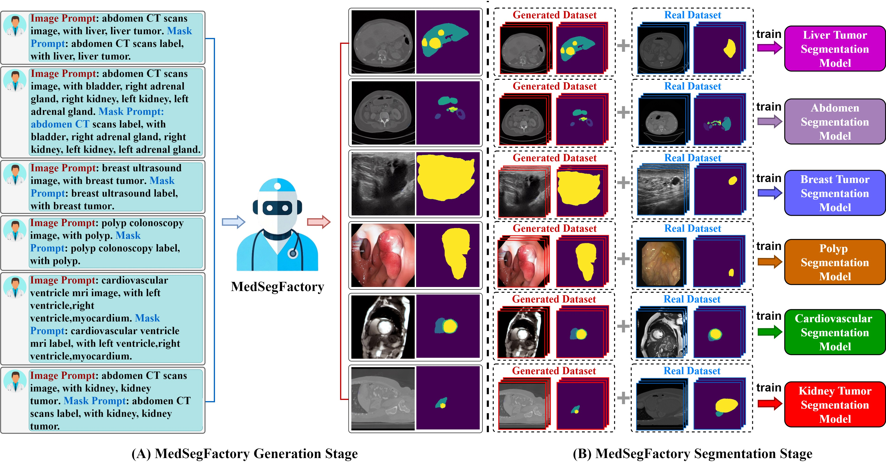
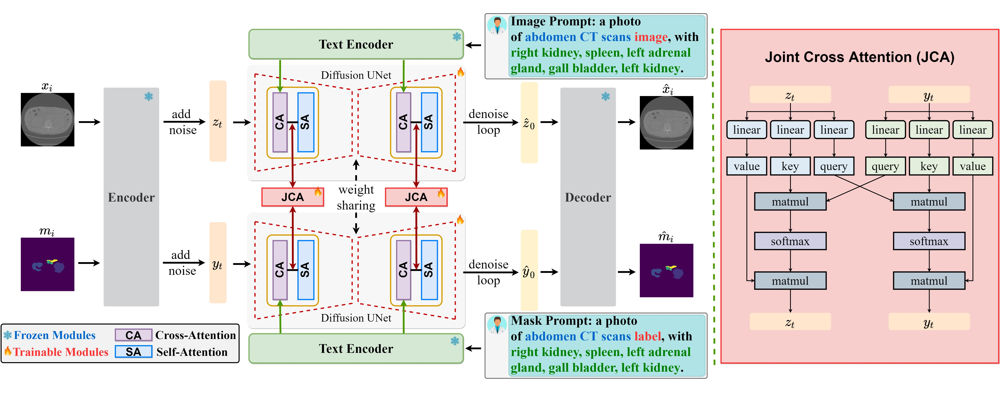
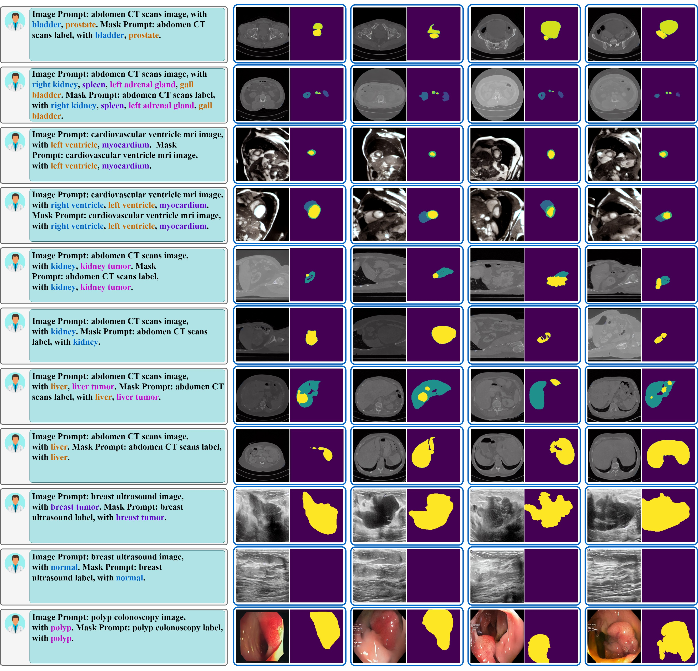

<p align="center">
  
</p>

# MedSegFactory: Text-Guided Generation of Medical Image-Mask Pairs
<span>
<a href="https://arxiv.org/abs/2504.06897"></a>
<a href="https://opensource.org/licenses/MIT"></a>  
<a href="https://jwmao1.github.io/MedSegFactory_web/"></a>
<a href="https://huggingface.co/spaces/JohnWeck/medsegfactory"></a>
</span>

Code for the paper [MedSegFactory: Text-Guided Generation of Medical Image-Mask Pairs](https://arxiv.org/abs/2504.06897) will be available soon. 

### About this repo:

The repository contains the official implementation of "MedSegFactory".

## 🏥 Introduction 

> This paper presents **MedSegFactory**, a versatile medical synthesis framework that generates high-quality paired medical images and segmentation masks across modalities and tasks. It aims to serve as an unlimited data repository, supplying image-mask pairs to enhance existing segmentation tools. The core of MedSegFactory is a dual-stream diffusion model, where one stream synthesizes medical images and the other generates corresponding segmentation masks. To ensure precise alignment between image-mask pairs, we introduce Joint Cross-Attention (JCA), enabling a collaborative denoising paradigm by dynamic cross-conditioning between streams. This bidirectional interaction allows both representations to guide each other's generation, enhancing consistency between generated pairs.
MedSegFactory unlocks on-demand generation of paired medical images and segmentation masks through user-defined prompts that specify the target labels, imaging modalities, anatomical regions, and pathological conditions, facilitating scalable and high-quality data generation. This new paradigm of medical image synthesis enables seamless integration into diverse medical imaging workflows, enhancing both efficiency and accuracy. Extensive experiments show that MedSegFactory generates data of superior quality and usability, achieving competitive or state-of-the-art performance in 2D and 3D segmentation tasks while addressing data scarcity and regulatory constraints.
<br>



## 🔥 News/TODO
- [x] [Paper](https://arxiv.org/abs/2504.06897) is released on ArXiv.
- [x] Source code of [gradio demo](https://huggingface.co/spaces/JohnWeck/medsegfactory/tree/main).
- [ ] Code released.
- [ ] Pretrained weight of MedSegFactory.
- [ ] Pretrained weights of nnUNet for MedSegFactory.

## 🧑‍⚕️ Framework 

> **Overview of the MedSegFactory Training Pipeline.** _Left:_ A dual-stream generation framework built upon the Stable Diffusion model, where each paired image and segmentation mask $\{x_{i}, m_{i}\}$ are first encoded into latent representations and noised. These noised representations are then denoised by the Diffusion U-Net, producing the image and segmentation mask latent $\{\hat z_{0},\hat y_{0}\}$, which are ultimately decoded into a paired image and mask $\{\hat x_{i},\hat m_{i}\}$. To improve their semantic consistency, we introduce **Joint Cross-Attention (JCA)**, which allows the denoised latent representations of both streams to act as dynamic conditions, enhancing the mutual generation of images and masks. _Right:_ A detailed illustration of JCA, which applies two cross-attention functions to the intermediate denoising features $\{z_{t}, y_{t}\}$, enabling the cross-conditioning of the medical image and segmentation label for improved consistency in the final outputs.
<br>



## 🚑 Performance 

### Examples 



## 🩺 Citation 

If you find this repository useful, please consider giving a star ⭐ and citation 💓:

```
@misc{mao2025medsegfactorytextguidedgenerationmedical,
      title={MedSegFactory: Text-Guided Generation of Medical Image-Mask Pairs}, 
      author={Jiawei Mao and Yuhan Wang and Yucheng Tang and Daguang Xu and Kang Wang and Yang Yang and Zongwei Zhou and Yuyin Zhou},
      year={2025},
      eprint={2504.06897},
      archivePrefix={arXiv},
      primaryClass={cs.CV},
      url={https://arxiv.org/abs/2504.06897}, 
}
```
